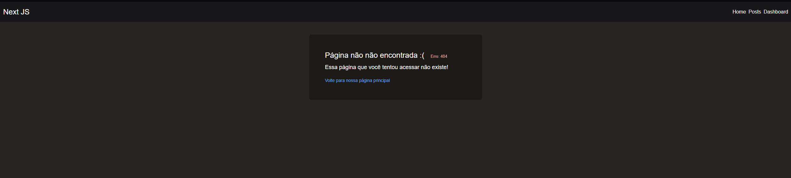

## NotFound
### Nesse subprojeto fizemos uma pagina de erro caso a navegação dê erro

* Como ficou no Desktop




## Metadata(SEO)
### Nesse subprojeto fizemos utilizamos metadatas(metadados)

* O que são metadatas(metadados) ?
      
      São informações que descrevem outros dados, facilitando a sua organização, busca e análises.Como por exemplo: Um Título;

* Demonstração de um Metadata(título)

  

## Links Gerais

* Link do Vídeo:
```
https://www.youtube.com/watch?v=e6FigV2fLC8
```

* Link da Documentação do Next JS:
```
https://nextjs.org/docs
```
